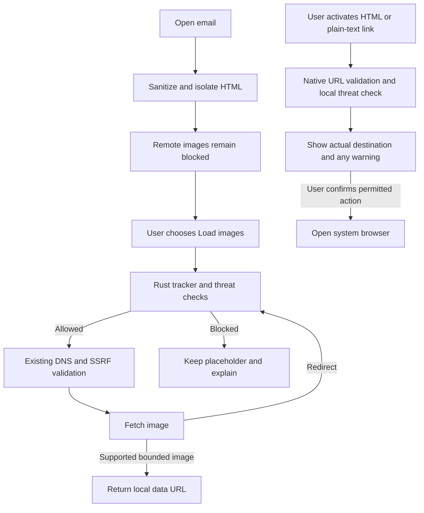

Research completed September 9, 2026. Code inspected at `6c873d3`, Postal Snap 0.1.6; Cargo.lock contains Tauri 2.11.5 and Wry 0.55.1. This document records feasibility research and a proposed design. It does not implement protection or establish detection accuracy.

Adding tracker, ad-resource, and malicious-link protection is feasible within the existing architecture. Recommended direction: enforce image filtering in Rust, add a shared native link-opening policy, and maintain separately licensed threat data. Preserve the current default of blocking remote images until consent.

The relevant code is concentrated in a few places:

| Code location                                                                              | Current behavior                                                                                                                                 | Proposed integration                                                                                                                        |
| ------------------------------------------------------------------------------------------ | ------------------------------------------------------------------------------------------------------------------------------------------------ | ------------------------------------------------------------------------------------------------------------------------------------------- |
| `src/security.ts:10`                                                                       | Removes active HTML, unsafe attributes and URLs; converts remote images into inert references.                                                   | Preserve sanitization; optionally identify obvious tracking-pixel candidates before fetching.                                               |
| `src/security.ts:100` and `src/components/MessageReader.tsx:1124`                          | CSP and iframe sandbox prohibit mail scripts; image sources are restricted to local representations.                                             | Keep these restrictions regardless of filtering settings.                                                                                   |
| `src/components/MessageReader.tsx:323`                                                     | Loads up to 60 images after consent, four concurrently; individual failures remain placeholders.                                                 | Show distinct outcomes for tracker blocks, threat blocks, and fetch failures.                                                               |
| `src-tauri/src/commands.rs:2416`                                                           | Accepts a remote-image URL and calls the Rust fetcher.                                                                                           | Add authoritative policy enforcement; use account/message ownership if introducing message-specific exceptions or context.                  |
| `src-tauri/src/security.rs:17`                                                             | Fetches images using reqwest; validates and pins public DNS addresses, revalidates redirects, limits bytes/time/types, rejects HTTPS downgrades. | Check every initial and redirected URL against filters before DNS lookup or network access.                                                 |
| `src/components/MessageReader.tsx:178` and `:297`                                          | Separate plain-text and HTML link handlers show confirmation and call the opener plugin.                                                         | Route both through one native validation, reputation, confirmation, and opening flow.                                                       |
| `src-tauri/capabilities/direct/default.json` and `src-tauri/capabilities/store/store.json` | Main window may invoke opener for HTTP(S) URLs.                                                                                                  | Once native opening owns policy, remove the generic frontend opening bypass; preserve trusted setup-help links through an explicit command. |
| `src/settings.ts`, `src-tauri/src/settings.rs`, `src/i18n.ts`                              | Existing settings validation and centralized UI strings.                                                                                         | Store protection preferences and present simple, accessible explanations.                                                                   |

One existing inconsistency deserves regression coverage during implementation: the plain-text handler rejects URL usernames/passwords; the HTML handler does not perform that check. For example, `https://trusted.example@destination.example/path` contains misleading user information before the real hostname. HTML links still require confirmation, but both paths should enforce the same URL policy.

The Rust image proxy runs on the user's device. It is not an anonymizing service: an allowed fetch exposes the user's network IP and sends any unique identifier embedded in the image URL. Its current SSRF defenses protect the device and local network; they do not classify public tracking or phishing destinations. Likewise, the existing TLS badge describes the mail-server connection, not the trustworthiness of a message or sender.

Tauri is not an absolute obstacle to browser extensions. Its installed Rust source exposes `browser_extensions_enabled` and `extensions_path`: Windows accepts unpacked Chrome extensions, Linux expects native `.so` WebKit extensions, and the extension-path API is unsupported on macOS. These are different extension systems. The framework's resource-response hook, `on_web_resource_request`, currently handles the Tauri URI protocol, not arbitrary internet requests. [Tauri API source](https://docs.rs/tauri/latest/src/tauri/webview/mod.rs.html)

Microsoft documents extension installation in WebView2, with missing browser-toolbar entry points for extension UI. This makes a Windows uBO Lite experiment plausible, but its required APIs and behavior would need runtime testing. Loading support does not establish full compatibility. [Microsoft WebView2 extension API](https://learn.microsoft.com/en-us/microsoft-edge/webview2/reference/win32/icorewebview2profile7)

uBO Lite uses browser-provided Manifest V3 filtering APIs. Copying its scripts or rules into React does not supply those APIs. Upstream also publishes `@gorhill/ubo-core`, an embeddable static network filtering engine, whose documentation describes its API as early and changeable. Reusing actual uBO internals is therefore possible in principle, but remains a custom integration. [uBO Lite](https://github.com/uBlockOrigin/uBOL-home), [uBO Core](https://github.com/gorhill/uBlock/tree/master/platform/npm)

Neither extension would automatically intercept this app's Rust reqwest image traffic, nor protect the separate system browser after `openUrl`. That conclusion follows from Postal Snap's actual request and opening paths. Upstream even notes that its Thunderbird extension covers feeds rather than email, reinforcing why email behavior must be evaluated explicitly. [uBO README](https://github.com/gorhill/uBlock#thunderbird)

| Approach                  | Fit for Postal Snap                              | Main tradeoff                                                                                |
| ------------------------- | ------------------------------------------------ | -------------------------------------------------------------------------------------------- |
| Brave `adblock-rust`      | Recommended for native network-rule matching.    | Requires list updates, email-specific request context, and separate threat detection.        |
| `@gorhill/ubo-core`       | Actual uBO engine reuse is technically possible. | JavaScript integration with Rust enforcement; GPL obligations and evolving API.              |
| `@ghostery/adblocker`     | Viable embeddable JavaScript alternative.        | Also needs custom integration with Rust fetching; frontend-only enforcement is insufficient. |
| uBO/uBO Lite extension    | Windows proof of concept possible.               | Platform differences; misses Rust requests; extra extension lifecycle/UI work.               |
| Platform content blockers | Native filtering exists on macOS and Linux.      | Separate platform adapters; still does not govern reqwest.                                   |
| Small domain matcher      | Useful for a domain-only baseline.               | Cannot express general path/query rules or safely reproduce full filter-list semantics.      |

Brave's engine supports network filtering, hosts syntax, and uBO syntax extensions. Version 0.13.3 was documented during research. Use network rules for this project; cosmetic filtering, scriptlet injection, and replacement resources are unnecessary for the first version. This is reuse of a filter engine, not a claim of complete uBO equivalence. [Brave engine](https://github.com/brave/adblock-rust), [crate documentation](https://docs.rs/adblock/latest/adblock/)

Two implementation details matter. First, the engine's default `single-thread` feature disables `Send`/`Sync`; either use a dedicated owning thread or disable that feature while selecting the other required features explicitly. Second, request matching includes resource type, source context, and third-party status. Email has no normal publisher-page origin: define and test that policy, and do not let a spoofable From address grant trust or let `tauri.localhost` accidentally determine exceptions. [Cargo features](https://github.com/brave/adblock-rust/blob/master/Cargo.toml), [request API](https://docs.rs/adblock/latest/adblock/request/struct.Request.html)

Apple provides JSON-based `WKContentRuleListStore` filtering for WKWebView, and WebKitGTK provides `UserContentFilterStore`. Both could matter if Postal Snap later embeds browsing. Neither is needed to filter the current Rust image fetcher. [Apple](https://developer.apple.com/documentation/webkit/wkcontentruleliststore), [WebKitGTK](https://webkitgtk.org/reference/webkit2gtk/2.40.1/class.UserContentFilterStore.html)

Update: Postal Snap is now open source under the root MPL-2.0 LICENSE. The earlier proprietary-product assumption is obsolete. Engine and data licenses still need separate evaluation. Brave and Ghostery's engines use MPL-2.0. Mozilla explains that MPL permits a larger proprietary application while requiring source availability and notices for covered code, including covered modifications. uBO Core and uBO Lite use GPL-3.0-or-later; integrating their code raises broader source-distribution questions. Charging money is not itself the issue, and separately distributing an extension is not identical to incorporating its code. [Mozilla MPL FAQ](https://www.mozilla.org/en-US/MPL/2.0/FAQ/), [Ghostery package](https://github.com/ghostery/adblocker/blob/master/packages/adblocker/package.json), [uBO Core license metadata](https://github.com/gorhill/uBlock/blob/master/platform/npm/package.json), [uBO Lite license header](https://github.com/gorhill/uBlock/blob/master/platform/mv3/extension/js/background.js)

EasyPrivacy explicitly covers email tracking and tracking pixels. Start with its network rules plus relevant EasyList ad-resource rules, then measure results against representative, synthetic email fixtures. Keep loaded legitimate images useful without promising that all remaining images are untracked. EasyList/EasyPrivacy offer GPL or CC BY-SA licensing; choosing the latter still requires attribution and handling adapted list data under its terms. Externally referenced lists can carry different licenses. [EasyPrivacy policy](https://easylist.to/pages/policy.html), [list licensing](https://easylist.to/pages/licence.html)

Phishing and malware protection needs a distinct data source and verdict model:

| Source               | What it offers                                                 | Current commercial/distribution consideration                                                                                                                                                                                                                                                                                                     |
| -------------------- | -------------------------------------------------------------- | ------------------------------------------------------------------------------------------------------------------------------------------------------------------------------------------------------------------------------------------------------------------------------------------------------------------------------------------------- |
| Block List Project   | Downloadable phishing and malware domain categories.           | Repository uses Unlicense. Candidate supplemental baseline; freshness, false positives, upstream provenance, and coverage were not benchmarked. Domain data misses malicious paths on otherwise legitimate hosts. [Project](https://github.com/blocklistproject/Lists), [license](https://github.com/blocklistproject/Lists/blob/master/LICENSE). |
| PhishTank            | Verified phishing URL downloads, updated hourly.               | FAQ permits commercial API use. Current terms page points to Cisco EULA and labels old terms archived: verify current embedding/redistribution rights and application-key access before shipping. [Downloads](https://phishtank.org/developer_info.php), [FAQ](https://phishtank.org/faq.php), [terms](https://phishtank.org/terms.php).          |
| OpenPhish            | Dedicated phishing feeds.                                      | Current terms require written consent for commercial use and restrict redistribution. Free community access is not shipping permission. [Terms](https://www.openphish.com/terms.html).                                                                                                                                                            |
| URLhaus              | Malware-distribution URL intelligence.                         | Commercial use may require subscription under fair-use terms; Auth-Key required. Explicitly excludes phishing submissions. [API documentation](https://urlhaus.abuse.ch/api/).                                                                                                                                                                    |
| Google Safe Browsing | Unsafe-URL intelligence.                                       | API is restricted to noncommercial use; not the default choice for this paid-capable app. [Restrictions](https://developers.google.com/safe-browsing/reference/rest).                                                                                                                                                                             |
| Google Web Risk      | Commercial unsafe-URL service, including phishing and malware. | Cloud billing/access and privacy decisions required. Lookup sends full URLs; Update supports local hash-prefix screening and confirmation requests. Returned information cannot simply be redistributed as a public feed. [Architecture](https://docs.cloud.google.com/web-risk/docs/overview).                                                   |

For scale comparison, Web Risk's published Lookup pricing includes 100,000 monthly calls free and then $0.50 per 1,000 up to its next threshold. Update hash-confirmation calls cost $50 per 1,000; list diffs are free. Those rates differ substantially, so model actual matching volume before choosing. A distributed desktop app also needs a deliberate API-key/quota design; embedding a shared billing credential is not a secure secret-distribution mechanism. [Web Risk pricing](https://cloud.google.com/web-risk/pricing)

Recommended first implementation would follow these two paths:

For links, show the actual hostname prominently and keep the full destination inspectable. Detect visible-URL/target mismatches and suspicious Unicode as warning signals, not automatic proof of phishing. Use proper public-suffix handling for domain comparisons; do not compare only the last two labels. Legitimate international domains and third-party email services must remain usable. [Unicode security mechanisms](https://www.unicode.org/reports/tr39/), [Public Suffix List](https://publicsuffix.org/learn/)

Apply threat checks to the exact URL being opened and any safely extracted destination. Retain provider-required path/query normalization for exact URL or hash matching; do not reduce every threat record to a whole-domain block, especially on shared hosting. Tracker allow rules must not override malware blocks or existing URL/SSRF restrictions.

Avoid speculative GET/HEAD requests to email links. They can disclose tracking identifiers or activate one-time actions. Known redirect wrappers can sometimes be decoded locally, with bounded parsing and revalidation; opaque short links remain unknown without contacting a server. Strip only well-understood tracking parameters with conservative exceptions, because login, unsubscribe, invoice, and signed-download URLs may depend on them. Preserve both original and cleaned forms for checks. This is proposed policy, not behavior already implemented.

Use distinct results such as `blocked_tracker`, `blocked_threat`, `suspicious`, `no_known_match`, and `unavailable`, with list freshness recorded separately. Keep the existing confirmation for ordinary links, a clear warning with a prominent cancel action for suspicious links, and default denial for known threats. A missing feed or no match must never produce an unqualified “safe” badge. Protection ends at the browser handoff; later redirects and page content depend on the browser's protections.

Local matching can preserve the no-Postal-Snap-cloud design. Ship an initial list snapshot and update from fixed HTTPS locations with size/parse limits, version and freshness checks, atomic replacement, and retention of the last valid snapshot. For redistributed, curated bundles, use signed metadata and rollback protection; use GitHub release assets where permitted. Only redistribute feeds whose licenses permit that. Definition downloads disclose an IP to their host but need not disclose message contents or clicked URLs. Do not log URLs, tokens, or message content.

The existing notice generators only list package names, versions, and license identifiers. Adding these engines/lists needs explicit source-availability information and list attribution/license packaging, extending the existing package scripts rather than creating a second release flow.

Ad-resource blocking has narrower scope than removing advertising text from email. Newsletter promotions, inline/CID advertisements, unknown first-party tracking images, and newly created phishing URLs may survive. No content blocker provides comprehensive spam filtering, attachment antivirus, sender authentication, or protection from every social-engineering message. Keep those product promises separate.

Implementation order: centralize native URL opening and its regression tests; add Rust network filtering to image loads; add validated definition updates and freshness reporting; then select and integrate a commercially usable phishing/malware feed. A local community-list version is feasible without operating a backend, but its measured coverage should determine product wording. A paid threat service remains an alternative if requirements justify its privacy, credential, and operating costs.

Verification performed during research: `npm run test -- src/tests/security.test.ts` passed all four tests. `npm run test:e2e -- --grep 'never fetches remote images before consent|renders received CID images without remote network access'` passed both existing flows. Browser tests used mocked IPC; they do not validate real Rust requests or all native WebViews. No runtime code or dependencies changed, and no engine integration, live threat detection, or filter-list accuracy benchmark was performed.

Future regression coverage should verify no network access for blocked initial URLs or redirects, unchanged SSRF protection, both link handlers plus keyboard/middle-click activation, user-info/IDN/misleading-label cases, list exceptions and resource types, account-scoped overrides, signed-link preservation, corrupt/stale list recovery, and engine-update concurrency. Native Windows/macOS/Linux tests remain necessary before release claims.
